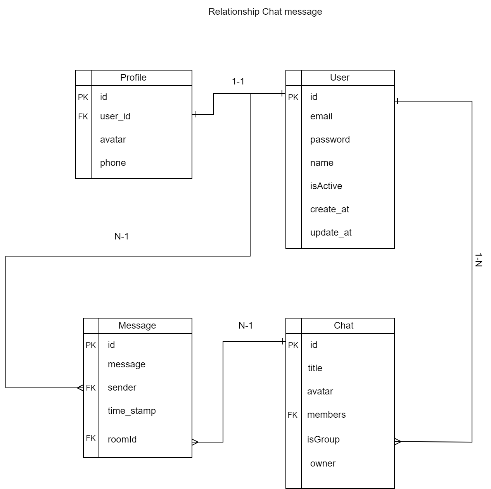
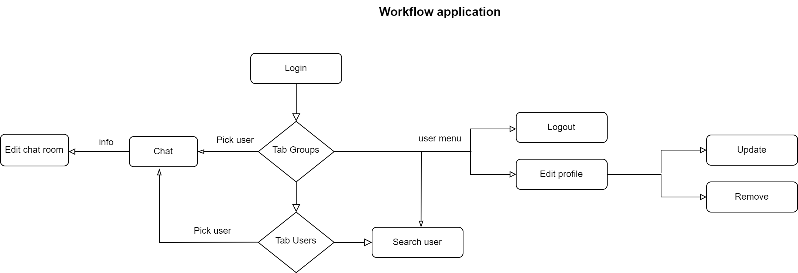

# React-training

# Practice-Advanced: Chat-App

### Overview

- Design: [Webix](https://webix.com/demos/chat-messenger/)
- Plan: [Plan training](https://docs.google.com/document/d/1utuEFICCPd5t2ZV1THibslI70-vojrtBM7bCe5b8Sxk/edit?usp=sharing)

#### Database diagram

### Targets

- Apply React Hooks advanced
- Apply Advanced Guides
- Apply useSWR
- Apply Unit test
- Optimizing Performance
- Storybook
- Apply firebase
- Apply zustand

### Requirements

- Create Chat app
- CRUD
- Search, filter user
- Chat groups, chat solo
- Apply storybook
- Apply unit test

### Information

- Timeline

  - Estimate day: 13 days
  - Actual day:

- Techniques:

  - HTML/CSS
  - Typescript
  - Storybook
  - Vite
  - Axios
  - Swr
  - ESLint with TypeScript
  - Tailwindcss
  - Jest
  - Library react testing
  - Zustand
  - Firebase

- Editor: Visual Studio Code.

- Source manager: Gitlab

### Development Environment

- node v20.12.1
- pnpm v9.0.1
- reactJS v18.3.1
- storybook v8.1.11
- vite v5.3.1
- eslint v8.57.0
- prettier v3.3.2
- typeScript v5.2.2
- axios v1.7.2
- uuid v10.0.0
- tailwindcss v3.4.4
- jest v29.7.0
- testing-library/react v16.0.0
- zustand: v4.5.4
- firebase v10.12.2

### Main App Feature

- Sign up user
- Sign in user
- View user info
- Edit user
- Update user
- Add new groups chat
- Chat solo
- Edit room chat
- Search users
- Remove user
- Logout

## Getting Started

- Step 1: Clone repository.

- With HTTPS:

  > `$ git clone --branch feat/practice-advanced https://gitlab.asoft-python.com/hung.mai/react-training.git`

- With SSH

  > `$ git clone --branch feat/practice-advanced git@gitlab.asoft-python.com:hung.mai/react-training.git`

- Step 2: Move to folder which just cloned in your computer.

> `cd ./react-training` > `cd ./practice-advanced`

- Step 3:

- Install the packages `pnpm i`

- Step 4:

> `pnpm start`

follow at:

<a href="http://127.0.0.1:5173/">http://127.0.0.1:5173/</a>

### Run storybook

> `pnpm run storybook`

follow at:

<a href="http://localhost:6006/">http://localhost:6006/</a>

### Run Unit test

> `pnpm run test` or `pnpm run coverage`

### Environment variable settings

To run this project, you need to Create a `.env` file similar to `.env.example` at your root directory with the following environment variables:

- `VITE_FIREBASE_API_KEY= your firebase api key`
- `VITE_FIREBASE_AUTH_DOMAIN= your firebase auth domain`
- `VITE_FIREBASE_PROJECT_ID= your firebase project id`
- `VITE_FIREBASE_STORAGE_BUCKET= your firebase storage bucket`
- `VITE_FIREBASE_MESSAGING_SENDER_ID= your firebase messaging sender id`
- `VITE_FIREBASE_APP_ID= your firebase app id`
- `VITE_FIREBASE_MEASUREMENT_ID= your firebase measurement id`
- `API_END_POINT= your api is used to call data`
